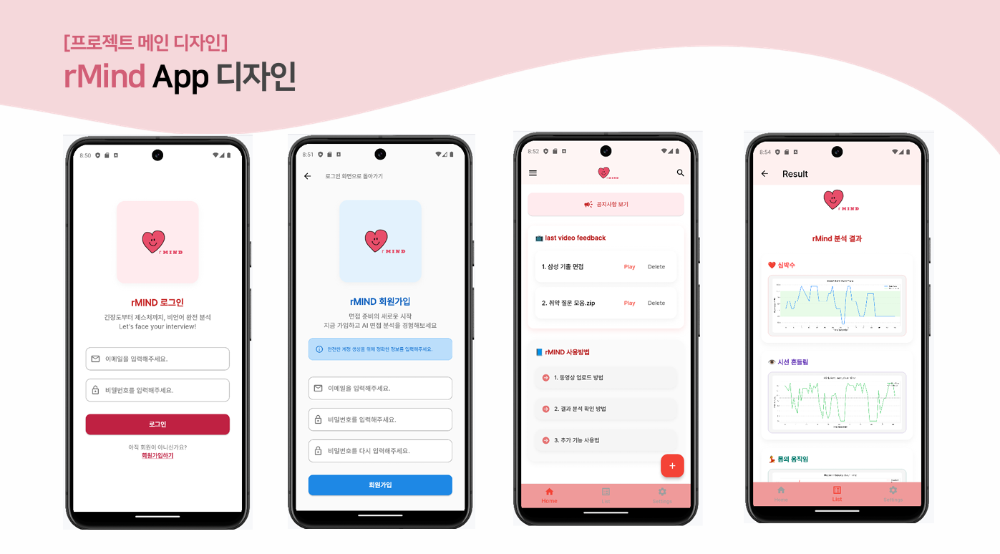
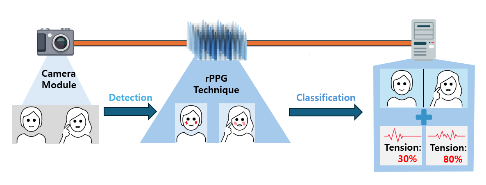

# rMind: AI Interview Feedback

rMind는 카메라 기반 **원격 광혈류 측정(remote photoplethysmography, rPPG)** 기술을 활용해  
면접 상황에서 나타나는 **비언어적 반응**을 분석·시각화하는 모바일 플랫폼입니다.

---

## 🎯 프로젝트 개요

- 기존 AI 면접 시스템이 **언어적 응답 위주**로만 피드백을 제공하는 한계를 극복
- **비언어적 신호(심박, 눈, 움직임)** 를 함께 분석하여 더욱 현실적인 피드백 제공
- 반복적인 분석과 결과 비교를 통해 **자기주도적 면접 훈련 환경** 지원

---

  

---

## 📝 주요 기능

- **회원가입 및 로그인**: 이메일 기반 계정 관리 및 개인화된 결과 저장
- **면접 영상 업로드**: Flutter 앱에서 녹화 영상을 선택 후 서버 전송
- **심박수(rPPG) 분석**: CHROM, POS, ICA 알고리즘으로 BPM 추정
- **눈 깜빡임 분석**: dlib 얼굴 랜드마크 기반 프레임 단위 감지
- **신체 움직임 분석**: 얼굴 중심점 변화를 계산하여 움직임 스코어화
- **시각화 결과 제공**: BPM 곡선, 깜빡임 빈도, 움직임 그래프 등 직관적 피드백

---

  

---

## ⚙️ 사용 기술

- **Frontend**: Flutter (Dart)
- **Backend**: FastAPI (Python)
- **Signal Processing**: OpenCV, NumPy, SciPy
- **Face Detection**: Haar Cascade, Dlib
- **rPPG 알고리즘**: CHROM, POS, ICA
- **심박수 추정 기법**: FFT, Wavelet, Interbeat Interval
- **데이터 포맷**: CSV(신호 저장), PNG(결과 시각화), JSON(메타데이터)

---

## 📂 시스템 구조

1. **모바일 앱 (Flutter)**

   - 로그인 / 회원가입
   - 면접 영상 업로드
   - 분석 결과 조회

2. **분석 서버 (FastAPI)**

   - 영상 수신 및 저장
   - rPPG 기반 심박 추출, 눈 깜빡임, 얼굴 움직임 분석
   - 결과 이미지·JSON 생성

3. **저장 및 시각화 계층**
   - 분석 결과 파일 저장
   - 앱으로 그래프 및 지표 전달

---

## 🚀 기대 효과

- 면접 준비 과정에서 **스스로의 비언어적 약점**을 파악 가능
- 반복 사용을 통한 **개선 추적**과 실력 향상 지원
- 기존 답변 중심 AI 면접 시스템과 차별화된 **정량적 생체 신호 분석** 기반 피드백
